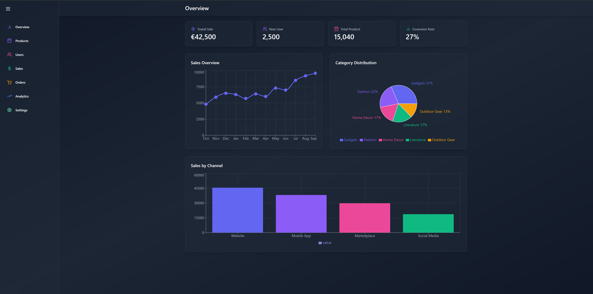

# **Admin Dashboard Application 📊 - Deployed on a Docker Container🐳**

This is a React-based dashboard application that was developed using Docker. It provides various pages including Overview, Products, Users, Sales, Orders, Analytics, and Settings. It utilizes React Router for navigation and is designed with a responsive layout and a gradient background for an enhanced user experience.

## **User Interface** 📸



## **Features** 🌟

- Responsive design with a fixed sidebar for navigation
- Multiple pages:
  - Overview
  - Products
  - Users
  - Sales
  - Orders
  - Analytics
  - Settings

## **Technology Used** 💻

- React ⚛️
- Recharts 📊
- Lucide React ⚛️
- Framer Motion 🎞️
- Uses React Router for seamless page transitions 🔄
- Built with Tailwind CSS for styling 🎨

## **Docker 🐳**

Make sure you have Docker Desktop running on your machine before proceeding.

The Admin Dashboard application is designed to be easily deployed using Docker. You can pull the pre-built Docker image from Docker Hub:

```bash
docker pull patrickpisten231/my-admin-dashboard:latest
```

Then, run the Docker container:

```bash
docker run -p 80:80 patrickpisten231/my-admin-dashboard:latest
```

The application should now be available at:

`http://localhost`

## **Routes 🗺️**

Once the application is running, you can navigate through the different pages using the sidebar. The main routes includes:

- `/Overview` - Overview Page 🏠
- `/products` - Products Page 📦
- `/users` - Users Page 👥
- `/sales` - Sales Page 💰
- `/orders` - Orders Page 📋
- `/analytics` - Analytics Page 📈
- `/settings` - Settings Page ⚙️

## **License** 📄

This project is licensed under the MIT License. See the LICENSE file for more details. 🔖

## **Contributing** 🤝

Contributions are welcome! Please open an issue or submit a pull request for any improvements or bug fixes. 💡
